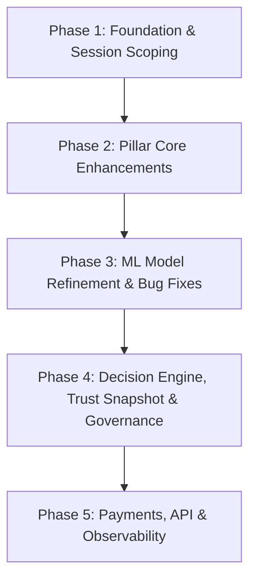

# SpendGuard Architectural Evolution Plan

> **Document Type**: System Audit, Bug Root-Cause Analysis, and Phased Implementation Plan  
> **Status**: APPROVED FOR REVIEW (Planning Mode — No Code Modifications)  
> **Target System**: SpendGuard AI Purchase Trust Layer  
> **Target Repository**: `/data/projectwork/razorpay`

---

## 1. Current State Summary

SpendGuard is an inline pre-payment trust and governance layer positioned between autonomous shopping agents and payment execution. Based on a comprehensive audit of the codebase, the current implementation consists of:

- **Pillar 1: Authorization Policy (`policy/`)**:
  - [`policy/schema.py`](file:///data/projectwork/razorpay/policy/schema.py): Defines `Mandate` with `per_transaction_cap`, `categories`, `merchants`, `time_window_start`, `time_window_end`, `issued_at`, and `ttl_seconds`.
  - [`policy/authorization.py`](file:///data/projectwork/razorpay/policy/authorization.py): Deterministically checks hard limits (`budget_exceeded`, `category_not_allowed`, `merchant_not_allowed`, `outside_time_window`) and evaluates mandate staleness (`is_stale = tx_ts > issued_at + ttl_seconds`).

- **Pillar 2: Intent Fidelity (`intent/`)**:
  - [`intent/schema.py`](file:///data/projectwork/razorpay/intent/schema.py): Defines `UserIntent` with `hard_requirements`, `soft_preferences`, and `substitution_allowed`.
  - [`intent/fidelity.py`](file:///data/projectwork/razorpay/intent/fidelity.py): Evaluates exact matches on top-level/spec attributes (with price ceiling handling for `max_price`) to produce `hard_match: bool`, and computes an unweighted ratio of matched recognizable preferences as `soft_score: float`.

- **Pillar 3: Evidence & Provenance (`evidence/`)**:
  - [`evidence/check.py`](file:///data/projectwork/razorpay/evidence/check.py): Verifies claimed product attributes/specs against ground-truth catalog records with $\pm 1\%$ price tolerance, outputting `conflicts: list[dict]` and `sources_checked: ["catalog_spec"]`.
  - [`evidence/provenance.py`](file:///data/projectwork/razorpay/evidence/provenance.py): Synthesizes an observable, chronological 4-step event trail (`search`, `candidates_found`, `candidates_eliminated`, `selected`).

- **Pillar 4: Behavioral Risk ML (`model/`)**:
  - [`model/features.py`](file:///data/projectwork/razorpay/model/features.py): Computes 9 non-lookahead features (`amount_ratio`, `category_novelty`, `merchant_novelty`, `trailing_1h_count`, `trailing_24h_sum`, `rolling_sum_ratio`, `time_deviation`, `amount_zscore`, `is_new_agent`) across an agent's cumulative chronological history.
  - [`model/train.py`](file:///data/projectwork/razorpay/model/train.py): Trains an `XGBClassifier` (depth 3, 40 estimators) on binary risk labels.
  - [`model/explain.py`](file:///data/projectwork/razorpay/model/explain.py): Generates top-2 feature importance explanations in plain English.

- **Decision Engine & Trust Gate (`decision/`)**:
  - [`decision/engine.py`](file:///data/projectwork/razorpay/decision/engine.py): Implements `evaluate_transaction()`. Enforces strict short-circuiting on deterministic failures (Pillars 1–3 fail $\rightarrow$ `BLOCK`, skipping subsequent pillars). If deterministic checks pass, evaluates ML risk score against global thresholds ($<0.30 \rightarrow \text{ALLOW}, 0.30\text{--}0.70 \rightarrow \text{VERIFY}, >0.70 \rightarrow \text{BLOCK}$) and applies upward nudges (stale mandate, soft score $\le 0.50$, soft evidence conflict) to `VERIFY`. Produces a structured `DecisionReceipt`.

- **Persistence, API, Payments & UI (`api/`, `payments/`, `frontend/`)**:
  - [`api/db.py`](file:///data/projectwork/razorpay/api/db.py): SQLite storage across `transactions`, `provenance_events`, and `audit_log`.
  - [`api/main.py`](file:///data/projectwork/razorpay/api/main.py): FastAPI application exposing `/transactions/evaluate`, `/transactions`, `/transactions/{id}/receipt`, `/transactions/{id}/verify`, and `/admin/seed_scenarios`.
  - [`payments/razorpay_client.py`](file:///data/projectwork/razorpay/payments/razorpay_client.py): Calls Razorpay Orders API exclusively when `decision == "ALLOW"` (immediately or upon human approval).
  - [`frontend/index.html`](file:///data/projectwork/razorpay/frontend/index.html): Real-time dashboard with transaction feeds, receipt inspection, pillar breakdown, and 1-click human verification controls.

---

## 2. Analysis of the 15 Targeted Improvements

### Improvement 1: Mandate Multi-Window & Recurrence Policies
- **Classification**: *Extension of existing code*.
- **Touchpoints**: [`policy/schema.py`](file:///data/projectwork/razorpay/policy/schema.py) (`Mandate` model) and [`policy/authorization.py`](file:///data/projectwork/razorpay/policy/authorization.py) (`_is_time_in_window()`, `check_authorization()`).
- **Description**: Expands single scalar `time_window_start`/`time_window_end` strings into a list of structured recurrence rules (e.g., day-of-week constraints, multiple active intervals, blackout periods, and timezone-aware operational envelopes).

### Improvement 2: Dynamic & Cumulative Budget Depletion Tracking
- **Classification**: *Extension of existing code*.
- **Touchpoints**: [`policy/schema.py`](file:///data/projectwork/razorpay/policy/schema.py), [`policy/authorization.py`](file:///data/projectwork/razorpay/policy/authorization.py), and [`api/db.py`](file:///data/projectwork/razorpay/api/db.py).
- **Description**: Introduces cumulative period caps (e.g., `daily_cap`, `monthly_cap`, `total_mandate_budget`) and real-time ledger depletion validation in `check_authorization()`, ensuring an agent cannot exhaust a cumulative allowance via legal sub-cap purchases.

### Improvement 3: Merchant Category Codes (MCC) & Domain Whitelisting
- **Classification**: *Extension of existing code*.
- **Touchpoints**: [`policy/schema.py`](file:///data/projectwork/razorpay/policy/schema.py), [`data/schema.py`](file:///data/projectwork/razorpay/data/schema.py) (`TransactionRequest`), and [`policy/authorization.py`](file:///data/projectwork/razorpay/policy/authorization.py).
- **Description**: Enhances merchant validation beyond raw string equality by adding structured merchant metadata (MCC, domain verification, payment gateway mid-tier identifiers) and wildcard pattern matching.

### Improvement 4: Intent Versioning & Temporal Immutability
- **Classification**: *Net-new module + schema extension*.
- **Touchpoints**: [`intent/schema.py`](file:///data/projectwork/razorpay/intent/schema.py) (`UserIntent`), `intent/versioning.py` *(new)*, and [`api/db.py`](file:///data/projectwork/razorpay/api/db.py).
- **Description**: Introduces `intent_version`, `parent_intent_id`, and cryptographic content hashing (`intent_hash`) to provide tamper-evident version history, preventing mid-session prompt-injection attacks from surreptitiously modifying user constraints.

### Improvement 5: Hierarchical & Weighted Soft Preference Scoring
- **Classification**: *Extension of existing code*.
- **Touchpoints**: [`intent/schema.py`](file:///data/projectwork/razorpay/intent/schema.py) and [`intent/fidelity.py`](file:///data/projectwork/razorpay/intent/fidelity.py) (`check_intent_fidelity()`).
- **Description**: Replaces flat arithmetic scoring with user-defined weights (e.g. `{"color": {"weight": 0.8, "val": "black"}, "noise_cancelling": {"weight": 1.0, "val": true}}`) and penalty curves for missing optional attributes, improving precision on substitution evaluations.

### Improvement 6: Session-Level Goal Drift & Intent Coherence
- **Classification**: *Net-new module*.
- **Touchpoints**: `intent/drift.py` *(new)*, [`data/schema.py`](file:///data/projectwork/razorpay/data/schema.py), and [`decision/engine.py`](file:///data/projectwork/razorpay/decision/engine.py).
- **Description**: Analyzes sequence vectors across multi-item checkout sessions to detect progressive goal drift or substitution degradation across sequential candidate selections.

### Improvement 7: Purchase Session Scoping & Contextual Baselines
- **Classification**: *Net-new module + schema extension*.
- **Touchpoints**: `session/manager.py` *(new)*, [`data/schema.py`](file:///data/projectwork/razorpay/data/schema.py) (`TransactionRequest.session_id`), and [`model/features.py`](file:///data/projectwork/razorpay/model/features.py).
- **Description**: Explicitly groups transactions into purchase sessions with declared intended totals (`session_budget`, `expected_item_count`), allowing velocity features to immediately catch split-payment burst #1 on initialization.

### Improvement 8: Dual-Threshold ML Risk Calibration & Nudge Decoupling
- **Classification**: *Extension of existing code*.
- **Touchpoints**: [`decision/engine.py`](file:///data/projectwork/razorpay/decision/engine.py) (`evaluate_transaction()`) and [`model/train.py`](file:///data/projectwork/razorpay/model/train.py).
- **Description**: Decouples the single global 0.70 threshold into scenario-aware decision bands ($T_{\text{block}} = 0.75, T_{\text{verify}} = 0.30$) and establishes an architectural ceiling that forbids nudge-tier triggers (substitutions, stale mandates) from escalating to `BLOCK` solely based on uncalibrated tree scores.

### Improvement 9: Windowed / Exponentially-Decaying Agent State Profiles
- **Classification**: *Extension of existing code*.
- **Touchpoints**: [`model/features.py`](file:///data/projectwork/razorpay/model/features.py) (`engineer_features()`, `agent_histories`).
- **Description**: Replaces unbounded cumulative historical statistics with sliding temporal windows (e.g. 7-day half-life decay, rolling 30-day baseline) and outlier filtering to prevent past synthetic bursts from polluting subsequent legitimate transactions.

### Improvement 10: Multi-Source Evidence Aggregation & Source Hierarchy
- **Classification**: *Extension of existing code*.
- **Touchpoints**: [`evidence/check.py`](file:///data/projectwork/razorpay/evidence/check.py) (`EvidenceResult`, `check_evidence()`) and `evidence/sources.py` *(new)*.
- **Description**: Extends evidence verification beyond single catalog spec checks to aggregate data across merchant spec sheets, checkout SKU APIs, and price history feeds with confidence-weighted source precedence.

### Improvement 11: Evidence Freshness, TTL & Proof Timestamping
- **Classification**: *Extension of existing code*.
- **Touchpoints**: [`evidence/check.py`](file:///data/projectwork/razorpay/evidence/check.py) (`EvidenceResult`) and [`data/schema.py`](file:///data/projectwork/razorpay/data/schema.py).
- **Description**: Adds `retrieved_at`, `source_ttl_seconds`, and `is_fresh` metadata to evidence verification records to prevent stale merchant caches from misrepresenting current product availability or dynamic pricing.

### Improvement 12: Cryptographic Proofs & Tamper-Evident Provenance Chains
- **Classification**: *Extension of existing code*.
- **Touchpoints**: [`evidence/provenance.py`](file:///data/projectwork/razorpay/evidence/provenance.py) (`build_provenance_trail()`, `log_provenance_event()`) and [`api/db.py`](file:///data/projectwork/razorpay/api/db.py).
- **Description**: Implements cryptographic SHA-256 hash chaining across consecutive provenance events ($H_i = \text{SHA256}(H_{i-1} \parallel \text{seq} \parallel \text{event\_type} \parallel \text{payload})$), ensuring the audit trail cannot be manipulated post-decision.

### Improvement 13: Trust Snapshot Generation
- **Classification**: *Net-new module*.
- **Touchpoints**: `decision/snapshot.py` *(new)*, [`decision/engine.py`](file:///data/projectwork/razorpay/decision/engine.py), and [`api/db.py`](file:///data/projectwork/razorpay/api/db.py).
- **Description**: Generates an immutable, exportable compliance artifact (`TrustSnapshot`) encapsulating the Decision Receipt, input payloads, active policy version, evidence proofs, provenance hash, and gateway response for external auditing.

### Improvement 14: Asynchronous Human Review Escalation & Webhooks
- **Classification**: *Net-new module + API extension*.
- **Touchpoints**: `api/escalations.py` *(new)*, [`api/main.py`](file:///data/projectwork/razorpay/api/main.py), and [`api/db.py`](file:///data/projectwork/razorpay/api/db.py).
- **Description**: Adds webhook event dispatching on `VERIFY` decisions, configurable SLA timeouts with fallback actions (auto-deny on expiration), and an escalation queue for human operators.

### Improvement 15: Two-Phase Payment Pre-Authorization & Hold
- **Classification**: *Extension of existing code*.
- **Touchpoints**: [`payments/razorpay_client.py`](file:///data/projectwork/razorpay/payments/razorpay_client.py) and [`api/main.py`](file:///data/projectwork/razorpay/api/main.py).
- **Description**: Replaces immediate order creation with a 2-phase payment workflow (authorization hold on `VERIFY`, automatic capture on approval, void on denial/timeout).

---

## 3. Root-Cause Analysis of Known Behavioral Risk Bugs

From the 110-scenario validation run, all 6 mismatches (94.55% match rate) originated in Pillar 4 (Behavioral Risk). Below is the precise root-cause analysis grounded in the code:

```
┌─────────────────────────────────────────────────────────────────────────────┐
│                      KNOWN BEHAVIORAL RISK ROOT CAUSES                      │
└─────────────────────────────────────────────────────────────────────────────┘
  1. Cold-Start Blindness (tx_0046)
     └── model/features.py:101-110 ──> priors=[] on burst tx #1 -> trailing counts = 0
     └── decision/engine.py:168   ──> risk=0.51 -> falls into VERIFY instead of BLOCK

  2. Threshold Collapse (tx_0038, tx_0041, tx_0084)
     └── decision/engine.py:170   ──> global risk > 0.70 hard-blocks immediately
     └── decision/engine.py:175   ──> nudges only execute if base == ALLOW; never caps ML

  3. State Leakage & Cross-Agent Contamination (tx_0110)
     └── model/features.py:75-88  ──> unbounded lifetime priors for agent_id
     └── model/features.py:116-131──> attack burst skews amount_zscore & time_deviation
```

### Bug 1: Cold-Start Blindness (First Transaction in Burst)
- **Manifestation**: Transaction `tx_0046` (the 1st transaction in a 10-payment split burst) resulted in `VERIFY` instead of `BLOCK`.
- **Exact Code Location**: [`model/features.py:101-110`](file:///data/projectwork/razorpay/model/features.py#L101-L110) and [`decision/engine.py:166-172`](file:///data/projectwork/razorpay/decision/engine.py#L166-L172).
- **Root Cause**:
  In [`model/features.py`](file:///data/projectwork/razorpay/model/features.py#L101-L110), `trailing_1h_count` and `trailing_1h_sum` are calculated strictly over historical `priors`. When transaction #1 of a split attack arrives, `priors` is empty:
  ```python
  prior_1h = [p for p in priors if one_hour_ago <= p["ts"] < ts]
  trailing_1h_count = len(prior_1h) # Equals 0
  trailing_1h_sum = sum(p["amount"] for p in prior_1h) # Equals 0.0
  rolling_sum_ratio = (trailing_1h_sum + amt) / cap # Equals 0.7498
  ```
  Because the transaction amount (₹29,990) is within the individual cap (₹40,000) and trailing counts are 0, the tree predicts a moderate risk score of `0.5106`.
  In [`decision/engine.py:168`](file:///data/projectwork/razorpay/decision/engine.py#L168), `0.30 <= risk_score <= 0.70` maps to `VERIFY`. Without session-level declarations (e.g. `session_id`, declared total purchase volume, or rapid burst intent), the model cannot distinguish the opening transaction of a burst from a standard single purchase.

### Bug 2: Threshold Collapse on Nudge Scenarios
- **Manifestation**: Transactions `tx_0038` & `tx_0041` (`substitution`) and `tx_0084` (`stale_mandate`) resulted in `BLOCK` instead of `VERIFY`.
- **Exact Code Location**: [`decision/engine.py:166-196`](file:///data/projectwork/razorpay/decision/engine.py#L166-L196) and [`model/train.py:24`](file:///data/projectwork/razorpay/model/train.py#L24).
- **Root Cause**:
  In [`decision/engine.py`](file:///data/projectwork/razorpay/decision/engine.py#L166-L172), decision routing strictly evaluates:
  ```python
  if risk_score < 0.3: decision = "ALLOW"
  elif risk_score <= 0.7: decision = "VERIFY"
  else: decision = "BLOCK"
  ```
  Nudge logic in lines 175–196 only nudges `ALLOW` upwards to `VERIFY`. It does **not** cap or guard transactions where deterministic policy intended a `VERIFY` (such as an allowed substitution or stale mandate).
  In `model/train.py:24`, `wrong_product` and `evidence_conflict` were labeled `1` during training. When substituted items had larger price points, the tree computed `risk_score > 0.70` (e.g. `0.76` and `0.80`). Because the global `0.70` threshold unconditionally triggered `BLOCK`, it collapsed the nudge tier and overrode the intent of the substitution policy.

### Bug 3: State Leakage & Contaminated Rolling Statistics
- **Manifestation**: Transaction `tx_0110` (`legitimate_unusual`) resulted in `VERIFY` (risk score `0.54`) instead of `ALLOW`.
- **Exact Code Location**: [`model/features.py:75-88, 116-131`](file:///data/projectwork/razorpay/model/features.py#L75-L88) and [`data/generate_scenarios.py:270-310`](file:///data/projectwork/razorpay/data/generate_scenarios.py#L270-L310).
- **Root Cause**:
  In `data/generate_scenarios.py`, `agent_software_01` was used to execute split-payment pattern #2 (10 rapid purchases of JetBrains licenses) and was subsequently reused for scenario row `tx_0110` (GitHub Copilot).
  In `model/features.py:75-88`, `agent_histories` accumulates all prior transactions indefinitely without window decay or session reset.
  In lines 116–131, `time_deviation` and `amount_zscore` computed their mean and standard deviation over all 10 prior malicious attack transactions. This polluted the baseline, causing `amount_zscore` and `time_deviation` to spike on `tx_0110`, pushing the risk score to `0.54` and incorrectly flagging a benign transaction for verification.

---

## 4. Phased Implementation Plan

The improvements and bug fixes must be executed in 5 dependency-ordered phases:



### Phase 1: Foundation, Schemas & Session Scoping (Prerequisites)
- **Focus**: Core data contracts and session scaffolding.
- **Tasks**:
  1. Introduce `PurchaseSession` schema in `data/schema.py` and session tracking in `session/manager.py`.
  2. Implement Intent Versioning contracts (`intent_version`, `parent_intent_id`, `intent_hash`) in `intent/schema.py` and `intent/versioning.py`.
  3. Expand `Mandate` schema in `policy/schema.py` for multi-window recurrence and cumulative period budgets.
  4. Fix Bug 3 (State Leakage): Introduce windowed/decaying agent history in `model/features.py`.

### Phase 2: Pillar Core Enhancements (Deterministic Policies & Evidence)
- **Focus**: Pillars 1, 2, and 4 logic updates.
- **Tasks**:
  5. Implement dynamic budget depletion and recurring time-window evaluation in `policy/authorization.py`.
  6. Implement weighted soft-preference scoring in `intent/fidelity.py` and goal drift evaluation in `intent/drift.py`.
  7. Add multi-source evidence aggregation, source TTL, and freshness timestamping in `evidence/check.py` and `evidence/sources.py`.
  8. Implement cryptographic SHA-256 hash chaining in `evidence/provenance.py`.

### Phase 3: Behavioral Risk ML & Bug Fixes (Pillar 3)
- **Focus**: Fixing cold-start blindness, threshold collapse, and training calibration.
- **Tasks**:
  9. Add session-scoped velocity features (`session_spend_ratio`, `burst_velocity`) in `model/features.py` to fix Bug 1 (Cold-Start Blindness).
  10. Retrain XGBoost model in `model/train.py` with cleanly partitioned features and updated labels.
  11. Implement dual-threshold calibration ($T_{\text{block}}=0.75$, $T_{\text{verify}}=0.30$) and nudge protection in `decision/engine.py` to fix Bug 2 (Threshold Collapse).

### Phase 4: Decision Engine, Trust Snapshot & Governance
- **Focus**: Trust Gate coordination and compliance artifact generation.
- **Tasks**:
  12. Refactor `decision/engine.py` to evaluate session drift, multi-source evidence, and dual-threshold ML routing.
  13. Implement `TrustSnapshot` generator in `decision/snapshot.py` to export self-contained audit packages.
  14. Update SQLite database schema in `api/db.py` to persist session IDs, trust snapshots, and intent versions.

### Phase 5: Payments, API & Observability Dashboard
- **Focus**: Two-phase payments, escalation workflows, and frontend.
- **Tasks**:
  15. Implement 2-phase pre-auth hold and capture in `payments/razorpay_client.py`.
  16. Implement escalation timeout management and webhooks in `api/escalations.py`.
  17. Update `api/main.py` endpoints and enhance `frontend/index.html` with session views, snapshot downloads, and weighted intent breakdowns.
  18. Run full 110+ scenario regression test suite and verify 100% decision match rate.

---

## 5. Proposed Final Repository Structure

```
/data/projectwork/razorpay/
├── README.md                           # System architecture and documentation
├── RESULTS.md                          # Validation benchmarks and evaluation metrics
├── PLAN.md                             # Architectural audit and implementation roadmap
├── requirements.txt                    # Project dependencies
│
├── data/
│   ├── schema.py                       # Core schemas (Agent, Product, TransactionRequest, PurchaseSession)
│   ├── catalog.py                      # 30-product ground truth catalog
│   ├── agents.json                     # Synthetic agent definitions
│   ├── mandates.json                   # Synthetic mandate definitions
│   ├── intents.json                    # Synthetic user intent definitions
│   ├── scenarios.csv                   # Labeled benchmark scenarios (110+ rows)
│   ├── generate_agents.py              # Agent and mandate generation script
│   ├── generate_scenarios.py           # Scenario generation script with session support
│   └── spendguard.db                   # SQLite persistence database
│
├── session/                            # [NEW] Purchase Session management
│   ├── __init__.py
│   └── manager.py                      # Session lifecycle, declared total tracking, and burst window management
│
├── policy/                             # Pillar 1: Authorization Policy
│   ├── __init__.py
│   ├── schema.py                       # Mandate, TimeWindowRule, PeriodBudget schemas
│   ├── authorization.py                # Multi-window and dynamic budget depletion authorization
│   └── recurrence.py                   # [NEW] Calendar/cron recurrence and operational envelope parsers
│
├── intent/                             # Pillar 2: Intent Fidelity
│   ├── __init__.py
│   ├── schema.py                       # UserIntent, WeightedPreference, IntentVersion schemas
│   ├── fidelity.py                     # Weighted preference matching and hard constraint check
│   ├── versioning.py                   # [NEW] Intent hashing, immutability, and version history
│   └── drift.py                        # [NEW] Multi-step purchase goal drift detection
│
├── evidence/                           # Pillar 3: Evidence & Provenance
│   ├── __init__.py
│   ├── check.py                        # Evidence comparison with freshness and TTL checks
│   ├── sources.py                      # [NEW] Multi-source evidence aggregation & confidence resolution
│   └── provenance.py                   # Cryptographically hash-chained provenance trail generator
│
├── model/                              # Pillar 4: Behavioral Risk ML
│   ├── __init__.py
│   ├── features.py                     # Non-lookahead, windowed, session-aware feature engineering
│   ├── train.py                        # Calibrated XGBoost risk classifier training script
│   ├── explain.py                      # Plain-English feature importance explainability generator
│   ├── risk_model.pkl                  # Serialized XGBoost model
│   └── feature_columns.json            # Model feature schema definition
│
├── decision/                           # Decision Engine & Trust Gate
│   ├── __init__.py
│   ├── engine.py                       # 4-Pillar coordinator with dual-threshold routing and nudge protection
│   └── snapshot.py                     # [NEW] Tamper-evident TrustSnapshot packaging and export
│
├── payments/                           # Payment Gateway Integration
│   ├── __init__.py
│   └── razorpay_client.py              # Razorpay 2-phase pre-auth hold, capture, and void integration
│
├── api/                                # REST API Layer
│   ├── __init__.py
│   ├── db.py                           # SQLite schema, session tables, and persistence helpers
│   ├── escalations.py                  # [NEW] SLA timeout workers, webhook dispatchers, and escalation queue
│   └── main.py                         # FastAPI routes and lifecycle event handlers
│
├── frontend/                           # Observability Dashboard
│   └── index.html                      # UI with session tracing, snapshot inspector, and review controls
│
└── tests/                              # Comprehensive Test Suite
    ├── test_authorization.py           # Pillar 1 tests (multi-window, budget depletion)
    ├── test_fidelity.py                # Pillar 2 tests (weighted preferences, versioning, drift)
    ├── test_evidence.py                # Pillar 3 tests (multi-source, freshness, hash chaining)
    ├── test_model.py                   # Pillar 4 tests (windowed features, cold start, calibration)
    ├── test_decision_engine.py         # Trust Gate integration and scenario batch tests
    ├── test_payments.py                # Razorpay 2-phase auth/capture tests
    ├── test_api.py                     # REST endpoints and escalation tests
    └── test_sessions.py                # [NEW] Purchase session management and drift tests
```

---

## 6. Conflicts & Breaking Changes Analysis

Below is an explicit inventory of architectural tensions, schema modifications, and backward-incompatible changes that require deliberate handling:

1. **`TransactionRequest` Schema Expansion (`session_id` & `intent_version`)**:
   - *Conflict*: Existing transactions in `data/scenarios.csv` lack `session_id` and `intent_version`.
   - *Resolution*: Make `session_id: Optional[str] = None` and `intent_version: int = 1` with default fallbacks so existing datasets and API clients remain fully operational without breaking.

2. **`Mandate` Schema Refactoring (`time_windows` & `period_budgets`)**:
   - *Conflict*: Modifying `time_window_start`/`time_window_end` strings to list of objects would break `data/mandates.json` and existing tests.
   - *Resolution*: Keep top-level `time_window_start` and `time_window_end` as backward-compatible legacy defaults, adding optional `time_windows: Optional[list[TimeWindowRule]] = None` and `period_caps: Optional[dict[str, float]] = None`.

3. **`UserIntent.soft_preferences` Structure Change**:
   - *Conflict*: Converting `soft_preferences` from `dict[str, Any]` to `dict[str, WeightedPreference]` could break existing string-based preference dictionaries.
   - *Resolution*: Support polymorphic parsing in Pydantic: allow either raw values (default weight `1.0`) or structured `{"val": ..., "weight": 0.8}` dictionaries.

4. **Deterministic Gate vs ML Nudge Precedence**:
   - *Conflict*: If an ML score is $> 0.70$ on a transaction that has passed all hard checks and is an allowed substitution, existing code hard-blocks it.
   - *Resolution*: Explicitly enforce the core invariant: **Nudge-tier classifications (`substitution`, `stale_mandate`) have a decision ceiling of `VERIFY`**. The decision engine will clamp ML-driven escalation so that policy-allowed substitutions never produce `BLOCK` solely from tree scores.

5. **Razorpay Direct Order Creation vs Two-Phase Pre-Authorization Hold**:
   - *Conflict*: Existing tests and dashboard expect `create_test_order()` to return an `order_xxx` ID directly upon `ALLOW`.
   - *Resolution*: Retain `order_id` generation on immediate `ALLOW`, but introduce authorization hold semantics on `VERIFY` so funds are earmarked without immediate capture until human approval.

---

*End of PLAN.md. Ready for user review and Phase 1 execution.*
