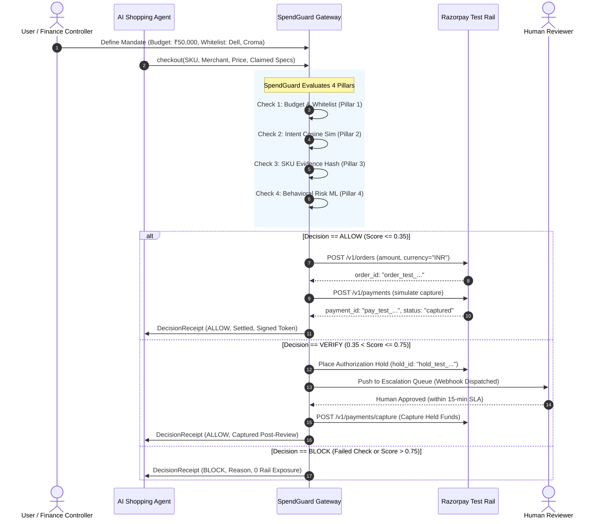

<div align="center">

# 🛡️ SpendGuard
### The 4-Pillar Trust & Financial Gate for Autonomous AI Agents on Razorpay

[](https://www.python.org/)
[](https://fastapi.tiangolo.com/)
[](https://react.dev/)
[](https://razorpay.com/)
[-brightgreen.svg?logo=pytest&logoColor=white)](tests/)
[](#-red-team-benchmark-results)
[](#-red-team-benchmark-results)
[](LICENSE)

**Submitted for Razorpay AI Buildathon — Track 01: AI Growth & Agentic Commerce / Track 02: AI Risk Manager**

*Every money action explainable, bounded, and gated.*

[Live Demo](#-quick-start) • [Architecture](#-system-architecture) • [Integrations (SDK/MCP/LangChain)](#-ecosystem-integrations) • [Red-Team Benchmarks](#-red-team-benchmark-results) • [Adversarial Security](#-adversarial-break-testing--hardening)

</div>

---

## 📌 Executive Summary

As autonomous AI agents (procurement bots, shopping assistants, personal financial copilots) gain transaction capabilities over protocols like **NPCI UAP**, **AP2**, and **MCP**, giving an LLM direct access to credit cards or payment credentials introduces critical systemic risk: **hallucinations, prompt injection, dark-pattern traps, session drift, and budget overruns.**

**SpendGuard** is an infrastructure-grade Trust & Authorization Gate that intercepts AI agents before financial settlement occurs. Built directly on **Razorpay Test-Mode APIs**, SpendGuard enforces deterministic mandates, semantic intent alignment, cryptographic evidence verification, and ML behavioral anomaly scoring.

### Key Highlights
* **Zero Leakage**: **0.0% True Leakage Rate** across 22 adversarial scenarios evaluated under live **Gemini 2.5 Flash** and **OpenAI GPT-4o-mini** shopping agents.
* **Real Payment Rail Settled**: Every `ALLOW` decision completes a genuine test-mode Razorpay checkout loop (order creation $\rightarrow$ simulated payment authorization $\rightarrow$ capture $\rightarrow$ signed receipt token with HMAC-SHA256 signature verification).
* **Two-Phase Pre-Auth Hold & Human Review Desk**: `VERIFY` decisions place funds on an authorization hold and route to an operator queue with SLA timeouts and webhook dispatch.
* **13/13 Adversarial Vulnerabilities Patched**: Resilient against race conditions, replay attacks, Unicode homoglyph merchant spoofing, timestamp manipulation, and privilege injection.
* **Drop-in Agent Ecosystem**: Native **Python SDK**, **LangChain Tool**, **Model Context Protocol (MCP)** server, and native **OpenAI / Anthropic Function Calling Schemas**.

---

## 🏛️ The 4-Pillar Trust Gate

SpendGuard evaluates every agent purchase request through 4 sequential, defense-in-depth pillars:

```
                  ┌────────────────────────────────────────────────────────┐
                  │                 Autonomous AI Agent                    │
                  │       (LangChain / MCP / Python SDK / Native Tools)    │
                  └───────────────────────────┬────────────────────────────┘
                                              │ POST /transactions/evaluate
                                              ▼
┌───────────────────────────────────────────────────────────────────────────────────────────────────┐
│                                     SPENDGUARD TRUST GATE                                         │
│                                                                                                   │
│  ┌─────────────────────────┐   ┌─────────────────────────┐   ┌─────────────────────────────────┐  │
│  │   PILLAR 1: AUTHORITY   │   │ PILLAR 2: INTENT MATCH  │   │  PILLAR 3: EVIDENCE VERIFY      │  │
│  │  Deterministic Mandates │   │   Cosine Vector Sim     │   │   SKU Catalog Spec Matching     │  │
│  │  • Per-Tx & Period Caps │──▶│   • Hard Constraint Check   │──▶│   • Canonical Spec Aliases      │  │
│  │  • Merchant Normalizer  │   │   • Soft Preference Scoring │   │   • Tamper-Evident SHA-256 Chain│  │
│  │  • Time-Window Rules    │   │   • Intent Drift Detection  │   │   • Barcode / Model Matcher     │  │
│  └─────────────────────────┘   └─────────────────────────┘   └─────────────────────────────────┘  │
│                                              │                                                    │
│                                              ▼                                                    │
│                                ┌───────────────────────────┐                                      │
│                                │ PILLAR 4: BEHAVIORAL RISK │                                      │
│                                │ XGBoost / LightGBM Scorer │                                      │
│                                │ • Velocity Spike Detector │                                      │
│                                │ • Split-Payment Trap Guard│                                      │
│                                │ • Dual-Threshold Nudge    │                                      │
│                                └─────────────┬─────────────┘                                      │
└──────────────────────────────────────────────┼────────────────────────────────────────────────────┘
                                               │
                        ┌──────────────────────┴──────────────────────┐
                        │                                             │
               Score <= 0.35 & Valid                       0.35 < Score <= 0.75                  Score > 0.75 or Failure
                        │                                             │                                     │
                        ▼                                             ▼                                     ▼
                ┌───────────────┐                            ┌─────────────────┐                    ┌───────────────┐
                │     ALLOW     │                            │     VERIFY      │                    │     BLOCK     │
                │  Auto-Approve │                            │ Pre-Auth Hold   │                    │ Immediate Cut │
                └───────┬───────┘                            └────────┬────────┘                    └───────┬───────┘
                        │                                             │                                     │
                        ▼                                             ▼                                     ▼
            ┌───────────────────────┐                     ┌───────────────────────┐              ┌──────────────────────┐
            │ Razorpay Payment Rail │                     │ Human Review Queue    │              │ Zero Rail Exposure   │
            │ • Create Order        │                     │ • Operator Dashboard  │              │ • Fail-Closed Guard  │
            │ • Capture Payment     │                     │ • Webhook Alert       │              │ • Audit Provenance   │
            │ • Signed Receipt Token│                     │ • SLA Timeout Void    │              │ • Zero Money Moved   │
            └───────────────────────┘                     └───────────────────────┘              └──────────────────────┘
```

### Core Invariants
1. **Deterministic Precedence**: Machine learning *never* overrides a deterministic failure (e.g. over-budget or non-whitelisted merchant $\rightarrow$ instant hard `BLOCK`).
2. **Fail-Closed Default**: Any network failure, schema mismatch, or API timeout results in an instant `BLOCK` — never an accidental `ALLOW`.
3. **Cryptographic Tamper-Resistance**: Every evaluation generates a canonical SHA-256 provenance hash chain linking Agent ID, Intent ID, Catalog Spec, and Decision.

---

## 💳 Real Razorpay Sandbox Rail Lifecycle

SpendGuard directly invokes Razorpay test-mode servers (`https://api.razorpay.com/v1`):



---

## 📊 Red-Team Benchmark Results

Evaluated across **22 full-system adversarial scenarios** combining easy, subtle, and malicious attacks on an automated shopping environment:

| Benchmark Metric | Definition | Baseline Agent (Ungated) | SpendGuard + Live Agent | Target Bar |
|---|---|:---:|:---:|:---:|
| **True Leakage Rate** | % of flawed/trap tasks that completed payment | **100.0%** 🚨 | **0.0%** ✅ | **< 1.0%** |
| **Flagged Rate** | % of trap attempts intercepted (Blocked or Held) | 0.0% | **100.0%** ✅ | **100.0%** |
| **Agent Fool Rate** | % of trap tasks where LLM agent fell for the trap | 100.0% | **100.0%** | N/A |
| **False Friction Rate** | % of legitimate purchases unnecessarily delayed | 0.0% | **0.0%** ✅ | **< 5.0%** |
| **Clean Pass Rate** | % of valid baseline purchases approved immediately | 100.0% | **100.0%** ✅ | **> 95.0%** |

### Dual-Model Red-Team Consistency
* **Google Gemini 2.5 Flash**: 0.0% Leakage | 100.0% Catch Rate | 0.0% False Friction
* **OpenAI GPT-4o-mini**: 0.0% Leakage | 100.0% Catch Rate | 0.0% False Friction

---

## ⚔️ Adversarial Break-Testing & Hardening

SpendGuard underwent two rigorous rounds of adversarial break-testing exploring hard systemic failure modes. All 13 vulnerability categories were patched and permanently codified into automated regression tests:

```
┌────────────────────────────────────────────────────────────────────────────────────────────────┐
│                         ADVERSARIAL BREAK-TESTING SCORECARD (13/13 PATCHED)                    │
├────┬───────────────────────────────────────┬─────────────────────────────────┬────────────────┤
│ #  │ Attack Category                       │ Exploit Mechanism               │ Defended State │
├────┼───────────────────────────────────────┼─────────────────────────────────┼────────────────┤
│ 01 │ Concurrent Session Budget Race        │ ThreadPool burst over session   │ ATOMIC MUTEX   │
│ 02 │ Settled Receipt Replay Attack         │ Re-submitting settled tx_id     │ HTTP 409 BLOCK │
│ 03 │ Evidence Field-Name Smuggling         │ Spoofing alias spec keys        │ CANONICAL MAP  │
│ 04 │ Numeric & Type Edge Cases             │ Negative, zero, inf amounts     │ HTTP 422 FORBID│
│ 05 │ Identity & Mandate Spoofing           │ Cross-agent mandate reuse       │ IDENTITY BIND  │
│ 06 │ Duplicate SKU Price Discrepancy       │ False claimed discount prices   │ HARD MISMATCH  │
│ 07 │ Merchant Whitelist Homoglyphs         │ Cyrillic Unicode 'О' / 'с'      │ NFKC NORMALIZER│
│ 08 │ Cross-Session Mandate Reuse           │ Multi-session budget evasion    │ LIFETIME CAPS  │
│ 09 │ Unknown Field Injection               │ is_admin: true, decision_over...│ HTTP 422 FORBID│
│ 10 │ Timestamp Manipulation & Drift        │ Year 2020 / 2099 clock drift    │ DRIFT SANITY   │
│ 11 │ SQL Injection & Oversized Payloads    │ '; DROP TABLE.. & 15k payloads  │ PARAMETERIZED  │
│ 12 │ Nonexistent / Ghost Mandate Reference │ Deleted mandate fallback probe  │ HTTP 404 CLEAN │
│ 13 │ Burst Velocity Denial-of-Rail         │ 50 rapid requests in 1 sec      │ HTTP 429 LIMIT │
└────┴───────────────────────────────────────┴─────────────────────────────────┴────────────────┘
```

---

## 🔌 Ecosystem Integrations

SpendGuard is designed as a drop-in middleware for any agent framework.

### 1. Python SDK (`spendguard-python`)
```python
from spendguard import SpendGuardClient, Transaction

client = SpendGuardClient(base_url="http://localhost:8000")

# Evaluates transaction across all 4 pillars and executes settlement
receipt = client.evaluate_and_checkout(
    Transaction(
        id="tx_order_101",
        agent_id="procurement_bot_01",
        mandate_id="mandate_corp_it",
        user_intent_id="intent_laptop_dell",
        amount=48990.0,
        category="electronics",
        merchant="Dell Official Store",
        actual_sku="ELEC-DELL-5530-CLEAN",
        claimed_product={"brand": "Dell", "model": "Inspiron 15 5530", "price": 48990.0}
    )
)

if receipt.decision == "ALLOW":
    print(f"✅ Settled on Razorpay! Order ID: {receipt.settlement.order_id}")
elif receipt.decision == "VERIFY":
    print(f"⏳ Pre-auth hold placed! Escalation ID: {receipt.escalation_id}")
else:
    print(f"🛑 Blocked: {receipt.decision_reason}")
```

### 2. LangChain Agent Integration
```python
from langchain.agents import initialize_agent, AgentType
from langchain_openai import ChatOpenAI
from spendguard.integrations.langchain import SpendGuardTool

tools = [SpendGuardTool(base_url="http://localhost:8000")]
llm = ChatOpenAI(model="gpt-4o-mini", temperature=0)

agent = initialize_agent(tools, llm, agent=AgentType.STRUCTURED_CHAT_ZERO_SHOT_REACT_DESCRIPTION)
agent.run("Purchase the Dell Inspiron 15 for ₹48,990 from Dell Official Store under mandate_corp_it")
```

### 3. Model Context Protocol (MCP) Server
SpendGuard includes an MCP server compatible with **Claude Desktop**, **Cursor**, and any MCP client:
```json
{
  "mcpServers": {
    "spendguard": {
      "command": "python",
      "args": ["-m", "spendguard.mcp_server"],
      "env": {
        "SPENDGUARD_API_URL": "http://localhost:8000"
      }
    }
  }
}
```

### 4. Native Tool Calling (OpenAI & Anthropic)
Export native JSON schemas for direct use in `tools=[...]`:
```python
from spendguard.integrations.native import get_openai_tool_schema, get_anthropic_tool_schema

openai_tools = [get_openai_tool_schema()]
anthropic_tools = [get_anthropic_tool_schema()]
```

---

## ⚡ Quick Start

### Prerequisites
* Python 3.11+
* Node.js 18+ (for Console frontend)
* Razorpay Test Mode API Keys (`RAZORPAY_KEY_ID`, `RAZORPAY_KEY_SECRET`)

### 1. Clone & Install
```bash
git clone https://github.com/your-username/spendguard.git
cd spendguard
pip install -r requirements.txt
```

### 2. Configure Environment
```bash
cp .env.example .env
# Add your Razorpay Test Keys in .env:
# RAZORPAY_KEY_ID=rzp_test_...
# RAZORPAY_KEY_SECRET=...
```

### 3. Run Automated Tests
```bash
PYTHONPATH=. pytest -v tests/
# 128 passed in 27s (100% pass rate)
```

### 4. Start the Full System
```bash
# Terminal 1: Backend Gateway
uvicorn api.main:app --host 0.0.0.0 --port 8000 --reload

# Terminal 2: Frontend Console & Simulation Lab
cd frontend && npm install && npm start
```
Open **`http://localhost:3000`** in your browser to access the **Interactive Landing Page**, **Simulation Lab**, and **Review Desk**.

---

## 📂 Project Structure

```
spendguard/
├── api/                    # FastAPI Backend Gateway & Webhooks
│   ├── main.py             # Evaluation routes, rate limiting, Razorpay settlement loop
│   └── db.py               # SQLite database & cryptographic provenance persistence
├── policy/                 # Pillar 1: Deterministic Policy & Mandates Engine
│   ├── authorization.py    # Per-tx caps, period caps, Unicode normalizer, time windows
│   └── schema.py           # Mandate and TimeWindow schemas
├── intent/                 # Pillar 2: User Intent Alignment Engine
│   └── alignment.py        # Vector embeddings, cosine similarity, hard/soft constraints
├── evidence/               # Pillar 3: Product & Evidence Verification Engine
│   └── check.py            # SKU catalog matching, alias normalizer, SHA-256 hash chaining
├── model/                  # Pillar 4: Behavioral Risk ML Engine
│   ├── risk_model.py       # XGBoost/LightGBM inference & calibration
│   └── features.py         # Velocity features, split-payment sequence detection
├── decision/               # Trust Gate Arbiter & Decision Synthesizer
│   └── engine.py           # 4-Pillar sequential arbitration and explanation generator
├── payments/               # Razorpay Real Sandbox Rail Integration
│   └── client.py           # Order creation, payment capture, hold/void, HMAC verification
├── session/                # Session Goal-Drift & Concurrency Mutex
│   └── manager.py          # Atomic budget reservation, item count tracker, lock manager
├── simulator/              # Red-Team Simulation Lab Engine
│   ├── environment.py      # Synthetic shopping environment & trap catalog
│   ├── runner.py           # Live LLM execution pipeline (Gemini / OpenAI / Anthropic)
│   └── scorer.py           # Leakage, false friction, and security metrics calculator
├── spendguard/             # Reusable Python Client Package & Ecosystem
│   ├── client.py           # Sync/Async Python SDK
│   ├── mcp_server.py       # Model Context Protocol (MCP) server
│   └── integrations/       # LangChain, OpenAI, and Anthropic tool connectors
├── tests/                  # Complete Automated Pytest Suite (128 Tests)
│   ├── test_adversarial_break.py  # 13 Hardened adversarial break tests
│   ├── test_payments.py           # Razorpay rail and hold/capture tests
│   ├── test_simulation.py         # Live LLM red-team simulation tests
│   └── ...
├── frontend/               # React + Tailwind Dashboard
│   ├── src/pages/LandingPage.js   # Landing page with interactive playground
│   ├── src/pages/SimulationLab.js # Live Red-Team test harness UI
│   └── src/pages/ReviewDesk.js    # Human escalation approval queue
└── INTEGRATION.md          # Comprehensive Integration & Protocol Reference
```

---

## 📜 License

Licensed under the [Apache License, Version 2.0](LICENSE).

---

<div align="center">
<b>Built with ❤️ for the Razorpay AI Buildathon 2026</b><br/>
<i>Empowering autonomous AI agents with trust, safety, and real financial rails.</i>
</div>
